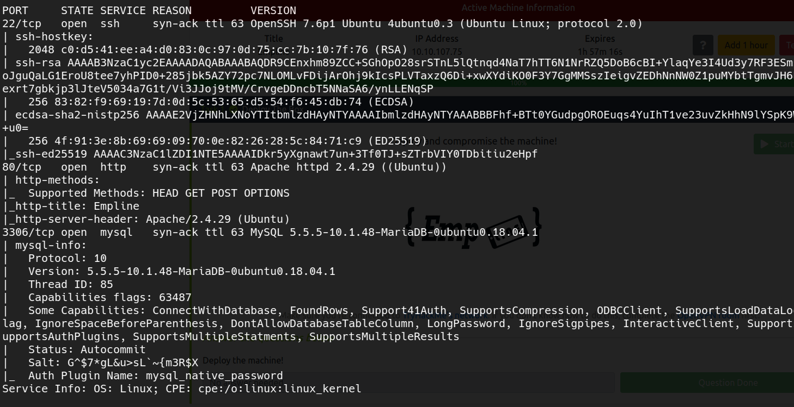
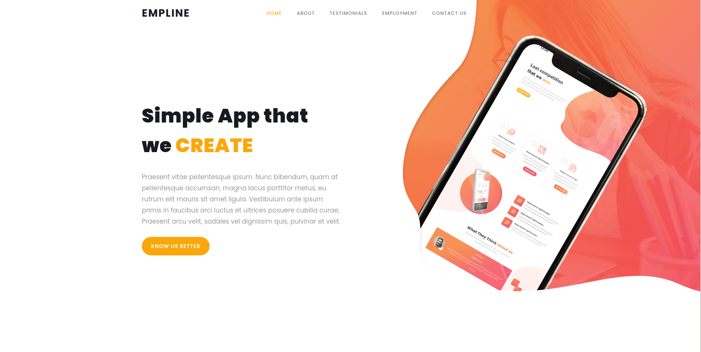
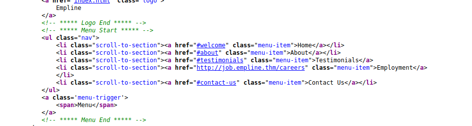
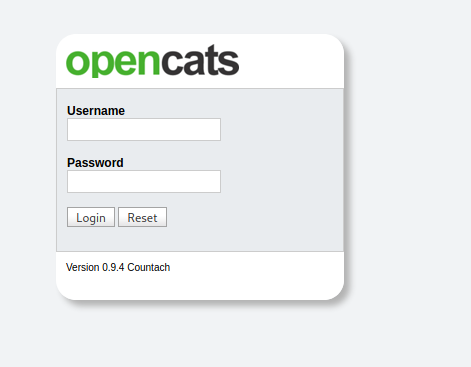
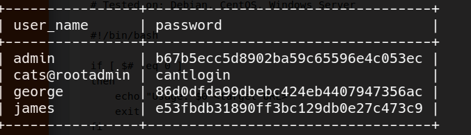

# Empline WriteUp (Tryhackme) by [yag1n3](https://github.com/yaguine)

### tags
* linux
* web
* privilege escalation
* enumeration

### objetives
* user flag
* root flag

---

## User Flag

### nmap 

  

### web

  
initially looks like a pretty uninteresting site  
the top-menu button "EMPLOYMENT" doesn't work, lets check the source code...
  
Aha !! that's a link to the subdomain *http://job.empline.thm*  

we add that to our hosts file and we see a login of an **opencats** web app  
  

we search exploits for this version and we find [this one](https://www.exploit-db.com/exploits/50316)  
with this exploit we can read remote files   

with gobuster we discovered some interesting files, including *config.php*   
we use the exploit with this syntax `python3 opencats_xss.py --url http://job.empline.thm --file ./config.php`  
we find the credentials **james:ng6pUFvsGNtw**  
those credentials work for the mysql ddbb and the opencats login  

afterwards we discover [this script](https://www.exploit-db.com/exploits/50585) that gives us RCE  
with the command `./opencats_rce.sh http://job.empline.thm` we achieve a shell as www-data  
on */home* we see the users "george" and "ubuntu"  

accesing the ddbb as **james**, we see a ddbb called "opencats" and a table called "user"  
we check the contents  
  
we see a user called **george**...its the same user of the target machine!!!  
we crack the hash and we get the credentials **george:pretonnevippasempre**   
they work on ssh  
we got **user.txt** !!!  

---

## root flag

after some enumeration, we check binaries capabilities and we discover this one :  
`/usr/local/bin/ruby = cap_chown+ep`  

we google it, and we find a command to change the ownership of a file  
`ruby -e 'require "fileutils"; FileUtils.chown(1002, 1002, "/etc/passwd")'`  

we create a new user with a chosen password and root privileges  
we get **root flag** !!!  

---

## Conclusion

A not really hard box, you have the opportunity to use different techniques as subdomain enumeration, hash cracking, etc... and i believe that makes it pretty fun and enjoyable machine.

